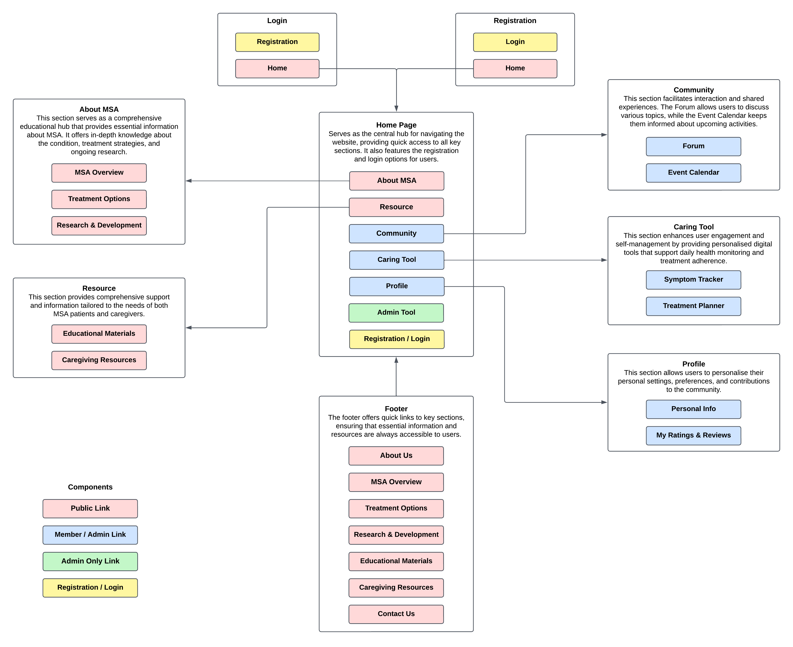

# MSA Hub 


> A cloud-based support platform for the Multiple System Atrophy (MSA) community, built to enhance accessibility, self-management, and health resource engagement for patients, caregivers, and professionals.

## 📺 Demo Video
👇🏻 Click below to view the demo video!
[](https://drive.google.com/file/d/1KgIYz2cyPt01B9fibrWCwP1kzAdjoUMl/view?usp=sharing)

## 📌 Project Overview
MSA Hub is a comprehensive platform tailored for the needs of people impacted by MSA. It offers educational content, community features, personalised tools, and administrative support functionalities to create an inclusive and supportive online environment.

### 🎯 Key Features
- **Public Access**: MSA Overview, Treatment Options, and Research updates
- **Community Interaction**: Forums, event calendar, profile personalisation
- **Caring Tools**: Symptom tracker, treatment planner
- **Admin Tools**: Role-based access, dashboard metrics, and content management
- **Additional Tools**: Interactive charts, aggregated ratings, bulk emailing via SendGrid

## 🗂 Sitemap


### 👤 Target Users
- MSA Patients
- Caregivers
- Medical Professionals
- Charity Administrators

## 🧠 Key Design Considerations
- Real-time data sync and visualisation
- Role-based access control (Admin/User)
- Calendar conflict management for bookings
- Secure email and cloud configuration

## 🛠 Tech Stack
- **Frontend**: Vue.js, Chart.js, FullCalendar.io
- **Backend / Cloud**: Firebase (Auth, Firestore, Cloud Functions, Storage), Google Cloud Functions

## 📂 Folder Structure
```bash
src/
├── components/
├── views/
├── assets/
├── router/
├── firebase/       # Firestore + Auth + Cloud Functions
└── utils/
```

---

This project is for academic and demonstration purposes only.
Thank you for visiting the MSA Hub project! Reach out for collaboration or inquiries.
